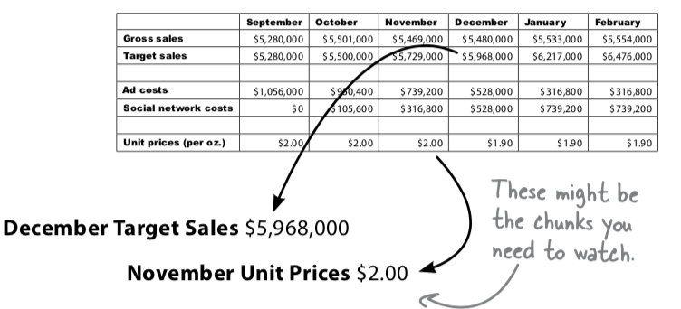

Disassemble

# Intro
The next step after "Define" is "Disassemble"

# Definition
Take what you've 
  1. learned about your problem from your client
  2. your data
break information down into the level of granularity that will best serve your analysis

# "Disassemble" _**Problem**_ Standard
Divide problems in to
- manageable
- solvable
chunks.

# "Divide" _**Data**_ Standard
* If Data is a **summary**:
  Which elements are most important
  
* If Data is s **raw**:
  Summarize elements first

# Main idea of disassemble: (Comparision)
The best way to start trying to **isolate the most important elements** of it is to find **strong comparisions**. (Please see example)

# Example:
1. Divide problems:
You may have a vague problem like:
  "How do we increase sales?"
We break it into 
  1. "What do our best customer want from us?"
  2. "Waht promotions are most likely to work?"
  3. "How is your advertising doing?"
**We answer smaller problems to solve the bigger one**
2. Comparison

  1. 不同月Sales对比
  2. 同月sales与target对比
  3. 同类变化程度对比 (ads and social)
  4. 单价成本降低和sales的对比